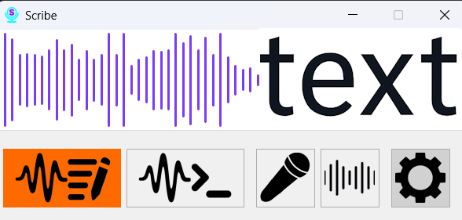

# Scribe

> A powerful, offline, real-time voice-to-text application for Windows.

Scribe is a versatile tool designed to integrate voice commands and transcription seamlessly into your workflow. Powered by the Vosk Offline Speech Recognition Toolkit, it ensures that all your data remains private by processing everything locally on your machine. Whether you need to dictate text, control applications with your voice, or automate repetitive tasks, Scribe provides a flexible and powerful solution.

## Key Features

*   **Real-Time Transcription:** Dictate text directly into any application with high accuracy.
*   **Command Mode:** Execute actions using custom voice commands.
*   **Offline and Private:** All voice processing happens locally on your machine. No data is ever sent to the cloud.
*   **Lightweight Performance:** Low CPU usage, especially when using small Vosk models, ensuring smooth operation without slowing down your system.
*   **Multi-Language Support:** Easily download and switch between different language models.
*   **Customizable Hotkeys:** Configure global hotkeys to start/stop modes and switch between active models.
*   **Text Replacements:** Define custom words or phrases that automatically expand into longer text snippets (e.g., "my email" -> "my.address@example.com").
*   **Voice-Activated Program Launch:** Set up voice commands to open any application or file on your computer.
*   **Flexible Configuration:** Fine-tune input methods (keyboard typing vs. clipboard paste), tray icon appearance, and window behavior to match your preferences.

## Getting Started

### Prerequisites

*   Windows 7 (64-bit) or newer.

### Installation

1.  Go to the [**Releases**](https://github.com/AIgrator/Scribe/releases) page.
2.  Download the latest `scribe-x64.exe` file from the "Assets" section.
3.  Run the executable. No installation is required.

## Building from Source

If you want to build the project from the source code, please follow the instructions in our [**BUILDING.md**](BUILDING.md) file.

## License

This project is licensed under the terms of the [LICENSE](LICENSE) file.

## Acknowledgments

This project relies on the excellent [Vosk Offline Speech Recognition Toolkit](https://alphacephei.com/vosk/).
