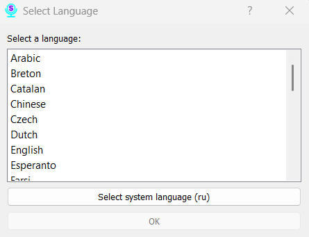

# Section 2: Initial Setup

When you first launch Scribe, a setup assistant will guide you through the initial configuration.

### Step 1: Select Interface Language

First, a window will appear to select the application's interface language. The language of this setup window itself is determined by your system's current keyboard layout.

In this window, you can choose the language that the entire Scribe interface will use going forward.

### Step 2: Download a Recognition Model

After selecting the interface language, a window will appear to download a speech recognition model. This model determines which language the program will understand and transcribe into text.

**Recommendation:** For a quick initial setup, we recommend choosing one of the lightweight models (around 40-100 MB). They download quickly and allow you to start using the program right away. Larger, more accurate models (1-2 GB or more) can be downloaded later from the settings menu, but their download may take a significant amount of time.

The model selected in this step will be set as the primary one.
