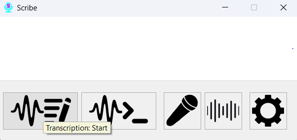
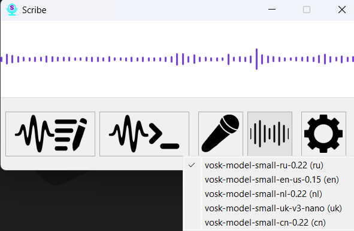
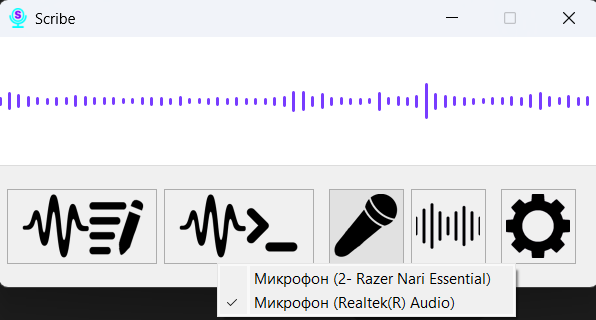
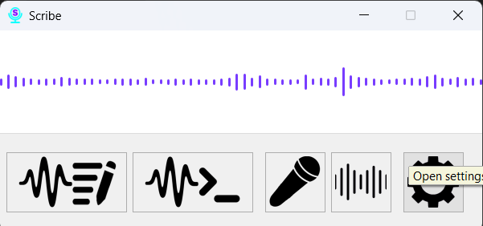

# Section 3: The Main Window

The main Scribe window is your control center. While the program can be used exclusively via hotkeys and the system tray icon, the window provides convenient visual control over all primary functions.

### Controls:

1.  **Transcription Button:** Clicking this button activates transcription mode. The program will start listening for audio from the selected microphone and convert speech to text in the active application. Clicking it again or using the hotkey will stop this mode.

2.  **Command Button:** This button switches the program into command-listening mode. After activation, you can speak your pre-configured commands. The mode deactivates automatically after a single command is recognized and executed.

3.  **Model Selection:** This dropdown list allows you to quickly switch between your downloaded speech recognition models. This is useful if you work with multiple languages.
    

4.  **Microphone Selection:** Here you can select the active microphone. If you connect a new device, it will appear in this list.
    

5.  **Settings Button:** The gear icon opens the settings window, where you can configure every aspect of the program in detail, from hotkeys to replacement rules.
    
