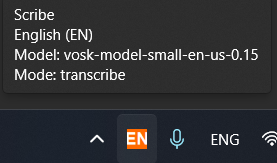
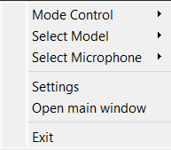

# Section 4: Tray Control

The Scribe icon in the system tray (next to the clock) is a powerful tool for managing the application, especially if you have hidden the main window.

*   **Informative Tooltip:** When you hover your cursor over the tray icon, a tooltip appears, displaying key information about the program's current state: the active mode ("Transcription" or "Command"), the selected recognition language, and whether file recording is enabled.
    

*   **Context Menu:** Right-clicking the icon opens a menu that duplicates the main functionality of the main window. From here, you can:
    *   Activate "Transcription" and "Command" modes.
    *   Quickly switch between models and microphones.
    *   Open the settings window.
    *   Exit the program.
    
