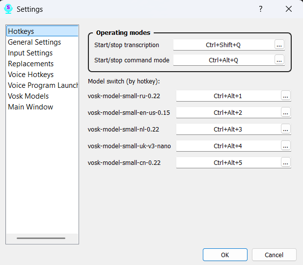

# Section 5: Settings — Hotkeys

This tab allows you to configure global hotkeys to control Scribe's main functions from any application, even when the main window is hidden.

### Main Actions:

*   **Transcription:** Set a key combination to start and stop transcription mode.
*   **Command:** Assign keys to activate the voice command mode.

### Model Management:

*   **Next Model:** This key combination allows you to cycle through all your downloaded speech recognition models.
*   **Hotkeys for Specific Models (Model 1 - Model 9):**
    *   The program automatically assigns hotkeys to the first nine models in your list. Model 1 will correspond to the first model in the list, Model 2 to the second, and so on.
    *   You can customize these combinations as you see fit. If you have more than nine models, you can assign hotkeys to the others manually, but by default, they will only be accessible through the menu or the "Next Model" hotkey.

### How to Change a Hotkey:

1.  Click on the input field next to the action you want to change.
2.  Press the desired key combination on your keyboard.
3.  Click the "Save" button at the bottom of the window to apply the changes.
