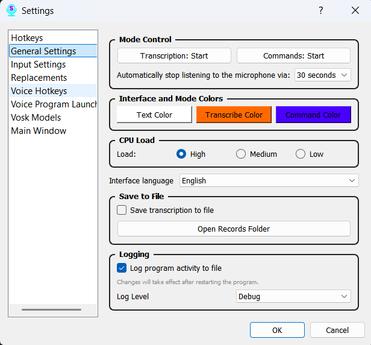

# Section 6: Settings — General

This tab contains the main settings for the application's operation, from mode control to performance and logging.

### Parameters (from top to bottom):

*   **Mode Control Buttons:** Right from this window, you can immediately activate "Transcription" or "Command" mode. This is useful for quickly testing the program's functionality without returning to the main window.

*   **Automatically stop listening to the microphone via:** This new feature helps save resources and prevent accidental recognition by automatically turning off the microphone after a set period of silence.
    *   **How it works:** A timer starts when listening begins. Every recognized word or phrase resets the timer. If you remain silent for longer than the specified duration, listening will stop. This works for both "Transcription" and "Command" modes.
    *   **Available options:** You can choose from several preset intervals (e.g., 10 seconds, 1 minute) or select "Never" to disable this feature.

*   **Transcription Button Color:** Allows you to choose the color that highlights the button in the main window and the tray icon when transcription mode is active.

*   **Command Button Color:** Similarly, allows you to set a unique color to indicate command-listening mode in the main window and tray.

*   **Tray Font Color:** Here you can select the color for the text displayed in the tray icon's tooltip. This is useful for improving readability against different desktop backgrounds.

*   **Reduce CPU Load:** Recommended for computers with lower performance. This option helps reduce processor resource consumption, which may slightly affect response time but makes the program more stable on less powerful hardware.

*   **Language:** Here you can manually change the application's interface language. Changes will take effect after restarting Scribe.

*   **Record to File:** Enabling this option activates the recording of all audio the program hears in "Transcription" and "Command" modes. Recordings are saved to a local folder.

*   **Recording Path:** A field to specify the folder where audio files will be saved if the "Record to File" option is enabled.

*   **Logging Level:** Allows you to choose how much detailed technical information the program will write to its log files. This is useful for diagnosing issues. Different levels are available, from INFO (main events) to DEBUG (maximum detail).

Don't forget to click the "Save" button after making changes.
