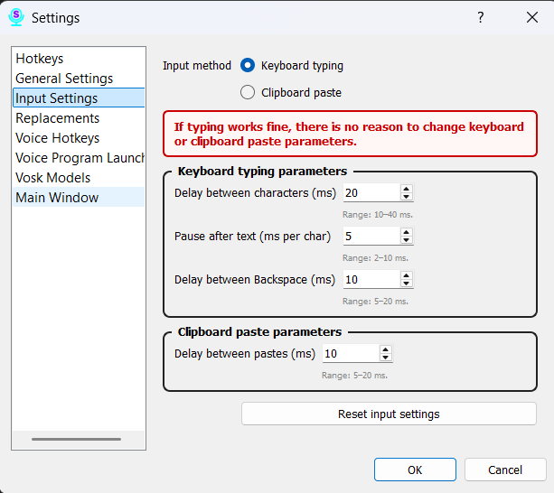

# Section 7: Settings — Input

This tab allows you to fine-tune the exact method Scribe uses to insert recognized text into other applications.

### Parameters:

*   **Text Insertion Method:**
    *   **Clipboard:** This is the default mode. It works very quickly by pasting text via the system clipboard. **Note:** When using this method, your clipboard's content is temporarily saved and will be restored immediately after Scribe inserts the text.
    *   **Keyboard:** In this mode, the program simulates key presses, typing each character individually. This method can be more compatible with certain applications (like games or terminals) that do not support fast pasting.

*   **Delay Before Insertion (ms):** Sets a pause in milliseconds before the program begins to insert text.

*   **Delay Between Characters (ms):** This is active only for the "Keyboard" method. It defines the pause between the typing of each character.

### Important Configuration Notes

**We strongly recommend not changing these values unless absolutely necessary.**

The default settings have been calibrated for stable performance. In "Keyboard" mode, the program intentionally inserts text in chunks no more frequently than once every half-second (500 ms). This limitation was introduced to solve an issue where, during rapid dictation, the program could accidentally delete manually typed user text while removing a previous partial result.

This limitation has resolved the problem. Therefore, you should only change these parameters if you fully understand the consequences and are facing specific compatibility issues.

Don't forget to click the "Save" button after making changes.
