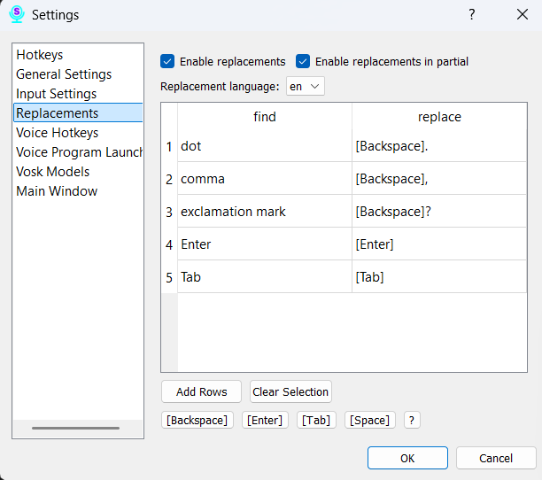

# Section 8: Settings — Replacements

This tab allows you to create rules for automatic, on-the-fly word replacements. This is one of Scribe's most powerful features for boosting productivity, inserting punctuation, and formatting text.

### Settings (from top to bottom):

*   **Enable Replacements:** This is the master switch for the entire feature. If this box is unchecked, none of your rules for the selected language will work.

*   **Replace in Partial Results:** Enabling this checkbox will cause Scribe to apply your replacement rules even to intermediate, "draft" speech recognition results.

*   **Select Language for Replacements:** In this dropdown list, you choose the language for which the rules in the table below will apply. **Important:** Replacement rules are tied to a specific language. If you use multiple language models, you can create a unique set of replacements for each one.

### Managing Rules in the Table

The table contains your rules for the selected language. Each rule consists of two columns:

*   **What to replace:** The word or phrase you will speak.
*   **What to replace with:** The text or symbol that will be inserted instead of the spoken phrase.

**Control Buttons:**

*   **Add:** Click this button to add a new empty row to the table to create a rule.
*   **Delete:** Select one or more rules in the table and click this button to remove them.

### Inserting Special Characters

At the bottom of the window, there are buttons for inserting control characters. To use them:
1.  Click on a cell in the "What to replace with" column.
2.  Click one of the buttons: **Backspace**, **Enter**, **Tab**, or **Space**.
3.  The program will automatically add a special code in square brackets to the cell, for example: `[Enter]`.

Be sure to click the **"Save"** button at the bottom of the window for all your changes to take effect.
