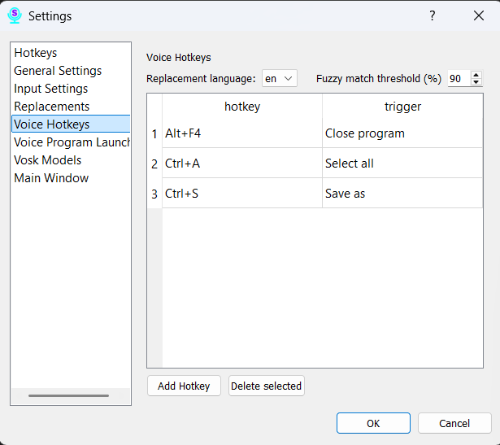

# Section 9: Settings — Voice Hotkeys

This tab allows you to create voice commands to emulate pressing almost any keyboard shortcut. You can say a phrase, and the program will press, for example, Ctrl+C or Alt+F4 for you.

### Selecting the Language for Commands

At the top of the page, there is a dropdown list to select the language. **Important:** Voice commands are tied to a specific recognition language. If you use multiple language models, you can create a unique set of commands for each one. Make sure you have selected the correct language before adding or editing rules.

### Managing Rules

The page contains a table with your rules. Each rule consists of:

*   **What to say:** The phrase you will speak to activate the command.
*   **Hotkey:** The keyboard shortcut that will be executed.
*   **Fuzzy Match:** This slider (from 80 to 100) determines how closely your spoken phrase must match the "What to say" field.
    *   **100:** Requires an exact match.
    *   **80-90:** Recommended values. The command will trigger even if you misspeak slightly.

### How to Add and Configure a Command

1.  Click the **"Add"** button to create a new row in the table.
2.  Enter the trigger phrase in the "What to say" column.
3.  Click the button in the "Hotkey" column. A dialog box will open where you need to press the key combination you want to save.
4.  Adjust the "Fuzzy Match" slider.
5.  To delete, select one or more rows and click the **"Delete"** button.

Be sure to click the **"Save"** button at the bottom of the window for all your changes to take effect.
