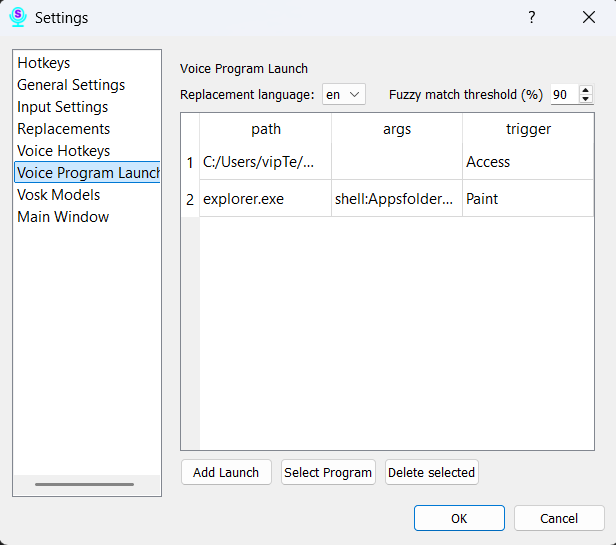
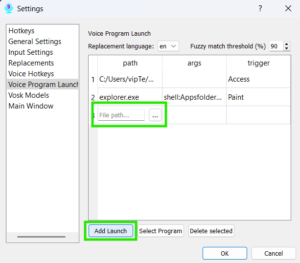
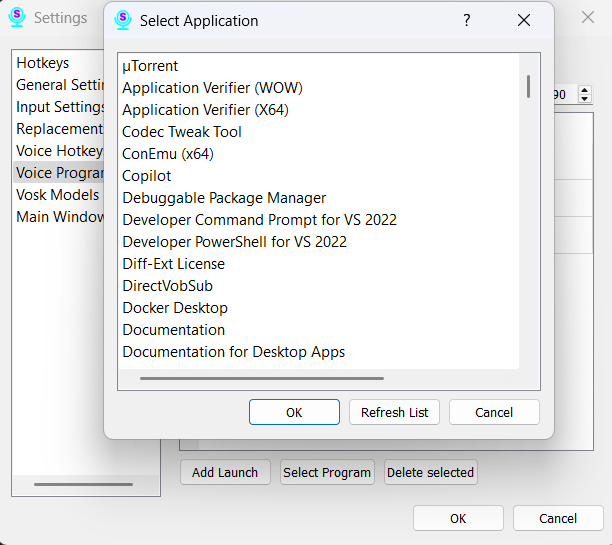

# Section 10: Settings — Voice Program Launch

This tab allows you to configure voice commands to launch any file or program on your computer. You can say a phrase, and Scribe will open the desired document, start an application, or even execute a script.

### Selecting the Language for Commands

At the top of the page, there is a dropdown list to select the language. Like other voice features, launch commands are tied to a specific recognition language. Make sure you have selected the correct language before creating rules.

### Managing Rules

The page contains a table with your rules. Each rule consists of:

*   **What to say:** The phrase you will speak to activate the command.
*   **File Path:** The full path to the program, file, or script that should be launched.
*   **Fuzzy Match:** This slider (from 80 to 100) determines how closely your spoken phrase must match the "What to say" field.
    *   **100:** Requires an exact match.
    *   **80-90:** Recommended values. The command will trigger even if you misspeak slightly.

### How to Add and Configure a Command

There are two ways to add a program or file to be launched by a voice command:

**Method 1: Using "Add Launch"**

This method is best for specifying a direct path to a file or a standard application.

1.  Click the **"Add Launch"** button to create a new row in the table.
2.  In the "File Path" column of the new row, you have two options for specifying the program or file:
    *   **Paste the path:** You can paste a previously copied path. **Important:** The path must be pasted without any single or double quotes at the beginning or end.
    *   **Select via dialog:** Click the **"..."** (ellipsis) button to open a standard file selection dialog, where you can navigate to and select the desired item.
3.  After setting the path, enter your desired trigger phrase in the "What to say" column. This is the phrase you will speak to launch the application.

**Method 2: Using "Select Program"**

This method is designed for selecting any installed program on your computer, and it is the **only way** to add UWP (Universal Windows Platform) applications (like those from the Microsoft Store), as they cannot be accessed through the standard file dialog.

1.  Click the **"Select program"** button.
2.  A dialog window will appear, displaying a list of all installed applications on your computer, including UWP apps.
3.  Select the desired program from the list.
4.  A new row will be added to the table. By default, the "What to say" field will be populated with the program's name, but you can change this to any phrase you prefer.
5.  When adding a program with this method, the "File Path" and "Args" fields are not user-editable.

### General Configuration

*   **Fuzzy Match:** Adjust the "Fuzzy Match" slider for any command. This determines how closely your speech needs to match the trigger phrase. This setting works the same way for all commands, regardless of how they were added.
*   **Deleting:** To delete a command, select one or more rows in the table and click the **"Delete"** button.

Be sure to click the **"Save"** button at the bottom of the window for all your changes to take effect.
