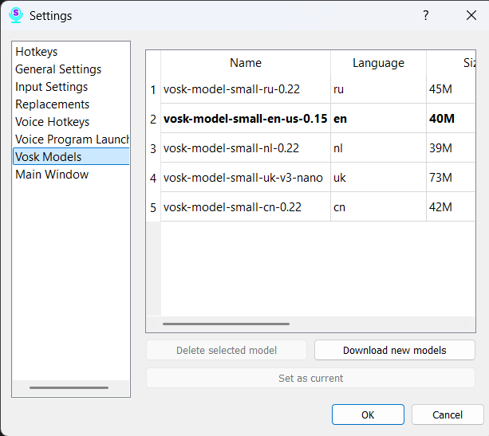

# Section 11: Settings — Vosk Models

This tab is your command center for speech recognition models. Here you can view installed models, set the active one, delete unnecessary ones, and download new ones.

### List of Installed Models

The main part of the screen is occupied by a table with the models already on your computer. It displays all the key information:
*   **Name:** The official name of the model.
*   **Size:** The model's size on disk.
*   **WER:** (Word Error Rate) — an indicator of the model's accuracy. The lower this value, the more accurate the model.
*   **Description:** Brief information about the model.
*   **License:** The type of license under which the model is distributed.
*   **Language:** The language that this model recognizes.

### Model Management:

*   **Set as Current:** Select a model in the list and click this button to make it active for recognition. The current model is highlighted in the table.

*   **Delete Selected Model:** Select a model and click this button to completely remove it from your computer. Be careful, this action is irreversible.

*   **Download New Models:** Clicking this button will open the familiar window you saw during the initial program setup. In it, you can select and download new models for other languages or more accurate versions for those already installed.
