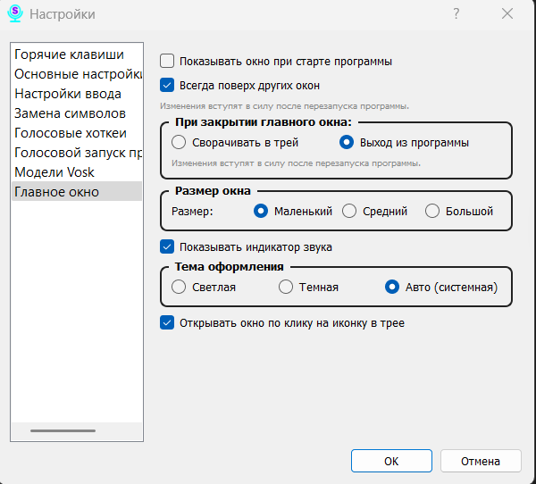

# Section 12: Settings — Main Window

On this tab, you can fully customize the appearance and behavior of the main program window.

### Parameters (from top to bottom):

*   **Show window on program start:** If this option is enabled, the main window will appear on the screen every time Scribe launches. If disabled, the program will start minimized to the system tray.

*   **Always on top of other windows:** Enable this option to keep the Scribe main window always visible above all other applications.

*   **When closing the main window:** This block determines what happens when you click the "X" in the corner of the window:
    *   **Minimize to tray:** The program will be hidden but will continue to run in the background. This is the default behavior.
    *   **Exit the program:** The application will be completely closed.

*   **Window Size:** Allows you to choose one of three preset sizes for the main window: "Small," "Medium," or "Large."

*   **Show sound indicator:** Enables or disables the visualization of the sound wave (microphone volume level) in the main window.

*   **Theme:** Choose the visual style of the program:
    *   **Light:** A classic light theme.
    *   **Dark:** A dark theme for comfortable work in low-light conditions.
    *   **Auto (System):** The theme will automatically adapt to your operating system's settings.

*   **Open window on tray icon click:** If this box is checked, a left-click on the Scribe icon in the system tray will open (show) the main window.
